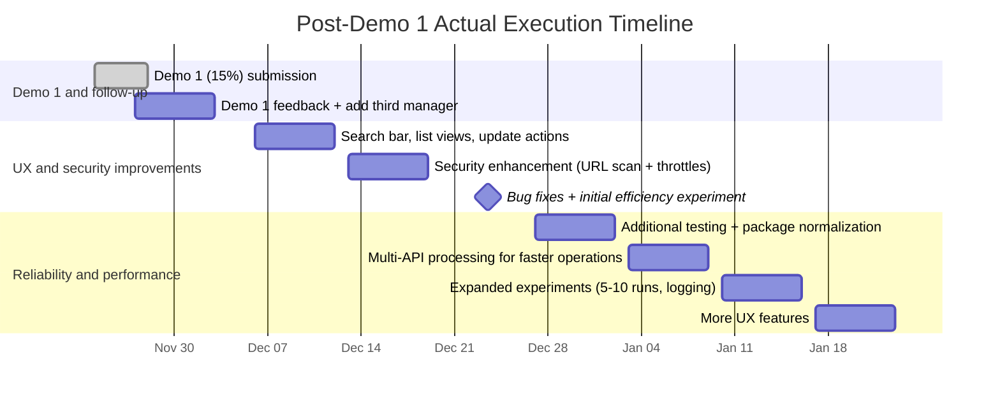

# CLI Package Manager Unifier — Cleaned Phase 1/2/3 Roadmap

## Scope and Assumptions
- Product scope: unified dependency operations across npm/pip family managers with security checks before install/upgrade.
- Security model: allow install by default, but provide clear risk summary and audit report.
- UX scope: terminal-first interface (CLI + optional TUI).

## Phase 1 — Core Expansion and Baseline Security
**Window:** Nov 3, 2025 → Jan 27, 2026  
**Objective:** stabilize core architecture, add high-priority managers, and remove ambiguous scan outcomes.

### Workstream 1: Core manager capabilities
1. Environment + baseline CLI setup complete.
2. Unification logic for npm + pip complete (list/search/install/upgrade).
3. Add manager support in this order:
   - yarn
   - pnpm
   - poetry
   - pipx
4. Keep command behavior consistent across all managers.

### Workstream 2: Security and scan clarity
1. Keep VirusTotal integration active.
2. Add OSV.dev integration as primary vulnerability source.
3. Normalize risk outcomes to: `block`, `warn`, `allow`, `not_scanned`.
4. Replace ambiguous “undetected” wording with explicit message:
   - no detections reported,
   - artifact not scanned,
   - provider unavailable.

### Workstream 3: Data and tests
1. Expand package cache schema to support multi-manager metadata.
2. Add manager-level unit tests for each command path.
3. Add scan result normalization tests.

### Milestones / deliverables
- Demo 1 complete (Nov 24–28).
- Post-Demo 1 implementation cycle executed (Nov 27–Jan 23).
- Demo 2 documentation submitted (Jan 27).
- Deliverables:
  - 6 manager support path (npm, pip, yarn, pnpm, poetry, pipx),
  - OSV + VirusTotal baseline,
  - deterministic risk labels,
  - basic automated tests.

### Actual execution after Demo 1 (what was done)

### Exit criteria
- All supported managers run list/search/install/upgrade successfully on sample packages.
- Every install/upgrade emits a deterministic security verdict.
- No “undetected-only” ambiguous output remains.

---

## Phase 2 — Reliability, UX, and Security Enrichment
**Window:** Jan 28, 2026 → Feb 27, 2026  
**Objective:** improve reliability under real conditions and expose results in a clearer user flow.

### Workstream 1: API enrichment and fallback
1. Add GitHub Advisory integration.
2. Add OSS Index integration.
3. Merge provider outputs into one consolidated decision model.
4. Implement provider timeouts/retries/rate-limit handling.

### Workstream 2: UX and usability
1. Build terminal UI flow (manager select, package search, risk summary, action result).
2. Add progress/status indicators for long operations.
3. Add human-readable security summary before final action.

### Workstream 3: Reliability hardening
1. Handle offline mode and provider outages gracefully.
2. Improve error diagnostics and logs.
3. Add integration tests for fallback behavior and edge cases.
4. Run repeatable experiment set (5–10 runs) and record timing/error metrics.

### Milestones / deliverables
- Demo 2 review package submitted (Feb 27).
- Deliverables:
  - 4-provider pipeline (OSV, GitHub Advisory, OSS Index, VirusTotal),
  - terminal UX path,
  - fallback and reliability test evidence.

### Exit criteria
- If one provider fails, system still returns usable verdict from remaining providers.
- Users can complete install flow from terminal UI with clear risk message.
- Experiment logs show reproducible results.

---

## Phase 3 — Final Quality, Evaluation, and Academic Outputs
**Window:** Feb 28, 2026 → Apr 27, 2026  
**Objective:** finalize product quality and complete all assessed outputs.

### Workstream 1: Advanced quality and validation
1. Add final reliability features (backup/report resilience, hardened error paths).
2. Complete full-system validation across supported managers.
3. Finish user-testing loop and apply actionable fixes.

### Workstream 2: Final demo and release readiness
1. Final bug-fix window.
2. Rehearse complete end-to-end demo scenarios.
3. Freeze feature set before final demo.

### Workstream 3: Poster and thesis track
1. Complete experiment analysis and thesis results chapter.
2. Draft and revise thesis chapters.
3. Prepare and finalize poster.
4. Final proofreading, references, formatting, thesis submission.

### Milestones / deliverables
- Poster submission due Apr 9.
- Final Demo planned Apr 16.
- Thesis submission due Apr 27.
- Deliverables:
  - validated system,
  - complete experiment dataset + analysis,
  - finalized poster and thesis.

### Exit criteria
- Final demo runs without critical blockers.
- Poster and thesis submitted on schedule.
- Documentation includes architecture, testing evidence, and risk-decision logic.

---

## Dependency-Correct Sequence (Summary)
1. Core manager + baseline security first.
2. Add additional managers before UX polishing.
3. Add provider enrichment before reliability experiments.
4. Complete reliability and user feedback before final optimization.
5. Lock final demo before thesis finalization.

## Measurable Acceptance Checklist
- [ ] All six managers operational for list/search/install/upgrade.
- [ ] Security result model emits only: block/warn/allow/not_scanned.
- [ ] Multi-provider fallback tested (provider outage simulation).
- [ ] Terminal UX path available and documented.
- [ ] Experiment log contains repeated trials with timing/error metrics.
- [ ] Final demo, poster, and thesis submitted by milestone dates.
